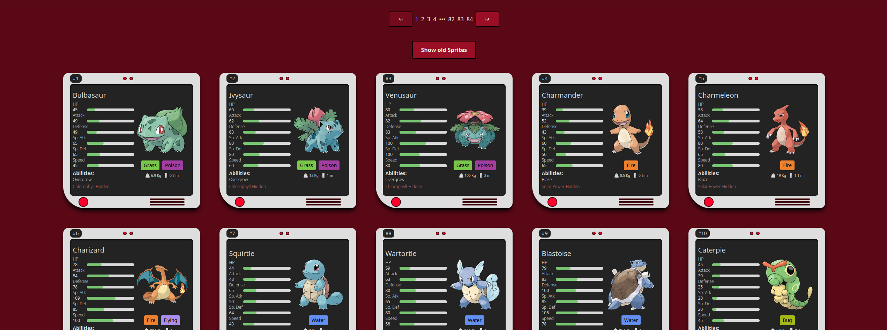

# Pokedex

This is a Pokedex App built using ReactJS and TypeScript. It fetches data from the [PokeAPI](https://pokeapi.co/) and displays information about different Pokemon.

# Getting Started

## Installation


1. Clone this repository to your local machine using:
```sh
git clone https://github.com/rafael-gon/pokedex.git
```

2. Navigate to the root directory of the project.
```sh
cd reactDex
```
3. Run npm install to install all the 
necessary dependencies.
```sh
yarn
```
or
```sh
npm install
```

4. Run expo start to start the Expo server.

```sh
yarn dev
```
or

```sh
npm run dev
```

5. Use the Expo Go app on your mobile device to scan the QR code and launch the app.


## screenshots

<p align="left">

</p>

---

 ## ✉️ Contact:

[](www.linkedin.com/in/rafael-gonçalves-52a146190)
[](mailto:contato@rafaelgoncalves.tech.com)
